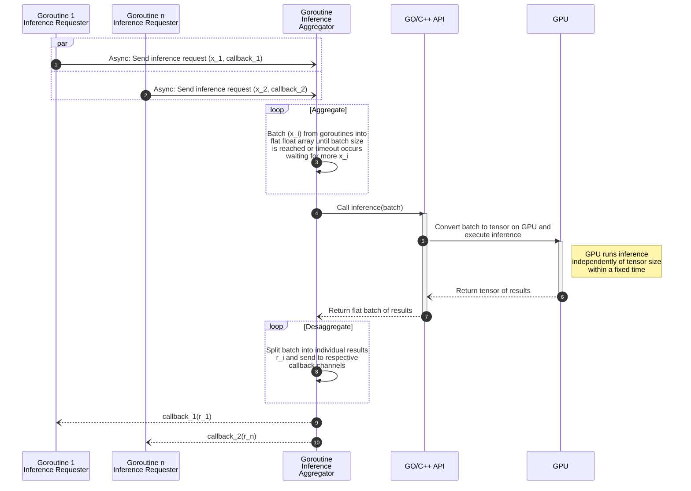

## Simple C++ Torch tutorial with Go binding

### Pre-requisites

This tutorial was tested on two different architectures, each of which requires its own specific development tool suite.

#### MacOS arm64 MPS

The MacOS code has been tested on MacOS arm64 (MPS) Sequoia, with command line xcode installed including _make_, _clang v16.0.0_.

* Install xcode CLI development tools from apple:

```
xcode-select --install
```

* Install [brew](https://brew.sh/), python3.12 or higher, and cmake

```
/bin/bash -c "$(curl -fsSL https://raw.githubusercontent.com/Homebrew/install/HEAD/install.sh)"
brew install python3.12
brew install cmake
```

#### Linux amd64 CUDA

This has been tested on Linux Ubuntu 24.04 with CUDA 12.2 and Nvidia A100.
The provided script [linux-setup.sh](./linux-setup.sh) automates the steps outlined below for this specific configuration and can serve as a starting point for other configurations.

You need _g++-12, build-essential,_ and _libxml2_. Note that CUDA Toolkit 12.2 will not work with a higher verison of g++ if using _cmake_.

* Install python and development tools

```
sudo apt update
sudo apt install -y  wget g++-12 build-essential git libxml2 unzip cmake python3.12 python3.12-venv
sudo apt autoremove -y
sudo apt -y clean
```

* Verify your CUDA driver and CUDA Toolkit version (_sudo apt install pciutils_ if you don't have _lspci_):

```
lspci | grep -i nvidia
nvidia-smi
nvcc --version
```

If _nvcc_ is not found, you must install a version of CUDA tooklkit from [nvidia developer](https://developer.nvidia.com/cuda-downloads/)
that is compatible with your CUDA driver.

### Verify your hardware configuration

To verify that your system has a supported GPU device, you can execute the following steps.
This process will create a virtual environment with PyTorch and the C++ libraries in _py/venv_,
and it will verify your hardware configuration and confirm that the appropriate device (either MPS or CUDA) is available.

```
cd py
. ./test_device.sh
```
### Install LibTorch++

LibTorch is required in order to compile a C++ application.

Two options are possible:

#### Libtorch++

Extract the appropriate **LibTorch** C++ zip from https://pytorch.org/ to a folder, e.g. _/usr/local/libtorch_.

If you intend to use _make_ you should also _export LIBTORCH=/usr/local/libtorch_.

If you intend to use _cmake_, verify that _CMAKE_PREFIX_PATH_ in all _*/CMakeLists.txt_ is properly set to include the home folder of the libtorch library.


#### PyTorch's Libtorch++

If you have already executed the _test_device.sh_ script, _libtorch_ will be installed
in the Python environment located at _py/venv_, typically under _lib/python3.*/site-packages/torch_

If you haven't run the script yet, create the Python virtual environment and install PyTorch inside the virtual environment using pip:

```
python -m venv venv
. venv/bin/activate
pip install torch
```

If you intend to use _make_, you should also set the _LIBTORCH_ environment variable to the libtorch folder inside PyTorch:

```
export LIBTORCH=$(python -c "import torch; print(torch.__path__[0])")/lib/python3.12/site-packages/torch
```

If you intend to use _cmake_, verify that _CMAKE_PREFIX_PATH_ in all _*/CMakeLists.txt_ is properly set to include the home folder of the libtorch library.

Note on C++ ABI Compatibility:
The version of PyTorch may have been compiled with the older C++ ABI, in which case you will get undefined symbols with
_cxx11_ during the compilation. If that happens, you must explicitly add the _-D_GLIBCXX_USE_CXX11_ABI=0_ flag to _CCFLAGS_ when building with make.
This is to ensures that the code is compiled using the same ABI as the PyTorch libraries.

### Verify the c++ compilation environment

Before attempting the Go/C++ binding make sure that you are at least able to run this simple C++ example.

You have two options:

##### CMake

If you have _cmake_ installed, you can build the sample app as follows.

```
cd c++
mkdir -p build
cd build
cmake ..
make
./test_torch
```

##### Make

CMake is excellent for portable builds, but troubleshooting can be difficult when issues arise.
To make things easier, we provide a simplified makefile that is easier to debug and adapt to your specific environments.

```
cd c++
make test_torch
./test_torch
```

In both options, if the executable fails due to a missing library, set _LD_LIBRARY_PATH_ (Linux) or _DYLD_LIBRARY_PATH_ (MacOS)
to include the path to the libtorch lib folder.

### Test the Go/C++ binding

As before, you have too options.

##### CMake

```
cd go
mkdir -p build
cd build
cmake ..
make
cd ..
LD_LIBRARY_PATH=. ./main
```

##### Make

```
cd go
make
LD_LIBRARY_PATH=. ./main
```

In both options, if the executable fails due to a missing library, set _LD_LIBRARY_PATH_ (Linux) or _DYLD_LIBRARY_PATH_ (MacOS)
to include the paths to the missing libraries.

### Test the C++ CNN

The example in the _cnn_ folder test the availability of the CNN deep learning libraries using on the MNIST data set.

The model is a convolutional neural network with two 2D convolutional layers, each followed by a ReLU activation and max pooling, and then fully connected layers for classification, ending with a softmax activation for multi-class output.

The model and data are moved to the GPU (if available) in batches (e.g., 64 in the code) to leverage parallel computation during both training and testing. The batch size is tunable (optional command line argument) to optimize performance.

##### CMake

```
cd cnn
./fetch_data.sh
cd build
ln -s ../data .
cmake ..
make
./test_cnn [batch_size]
```

##### Make

```
cd cnn
make
./test_cnn [batch_size]
```

### Test the Go-C++ binding for CNN

This example demonstrates the same convolutional neural network (CNN) model in a system that integrates Go and C++ to optimize GPU utilization and prevent GPU starvation. Multiple goroutines submit inference requests, along with a pointer to their respective callback channel, through a buffered Go channel. These requests are then aggregated into a batch by the Inference Aggregator goroutine. Once the batch is either ready or a timeout is reached while waiting for additional requests, it is forwarded to the C++ API. The C++ layer offloads the computation to the GPU. After the GPU computation is complete, the results are desaggregated and sent back to the corresponding goroutines through callback channels.

The system’s performance can be tuned through optional CLI arguments, which allow adjustment of factors such as batch size, the number of sender goroutines, and the number of requests per sender.

The following diagram illustrates the sequence of operations in the system:



##### CMake

```
cd go-cnn
cd build
cmake ..
make
cd ..
LD_LIBRARY_PATH=. ./main [batchSize numSenders requestsPerSender [batchTimeoutMs]]
```

##### Make

```
cd go-cnn
make
LD_LIBRARY_PATH=. ./main [batchSize numSenders requestsPerSender [batchTimeoutMs]]
```

### TODO

Several improvements can be made to the Go-C++ integration.

* Currently, the code implements a C++ model factory, hardcoded for a specific convolutional neural network model tailored for MNIST data.
Ideally, it should implement a dlloader to enable the dynamic instantiation of models by name, with the possibility of including optional configuration parameters.
* While some effort has been made to support tensors of various shapes, the current C++ interface is designed to support a limited set of model architectures, and may not be well-suited for more complex models like GraphNet.

